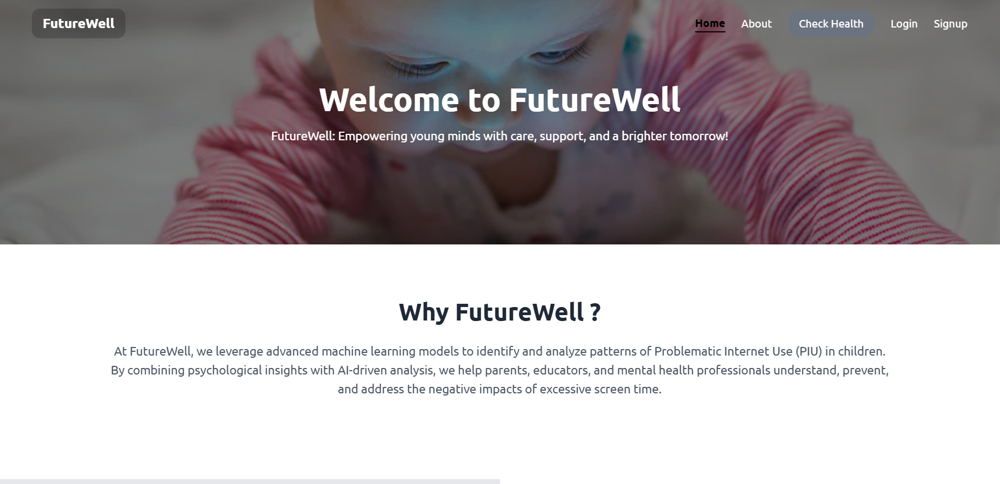
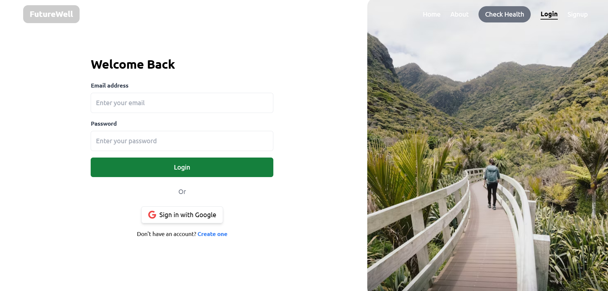
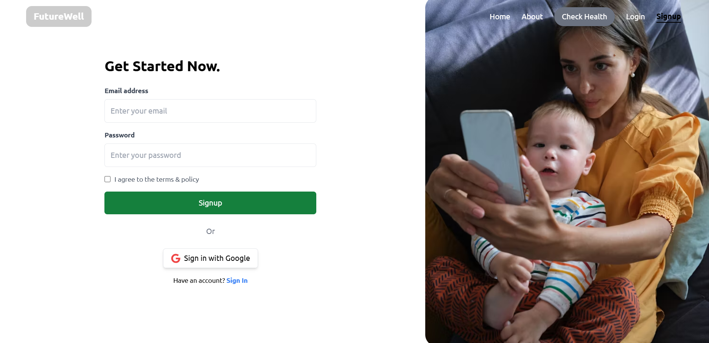
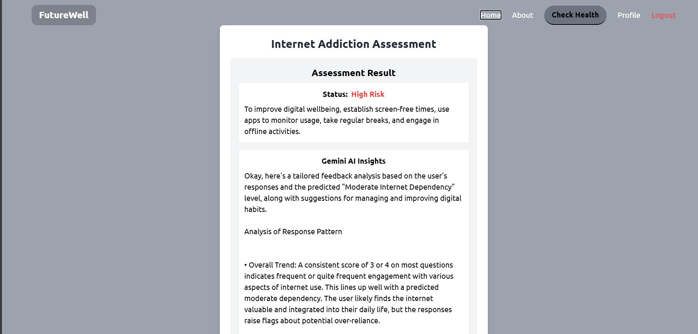
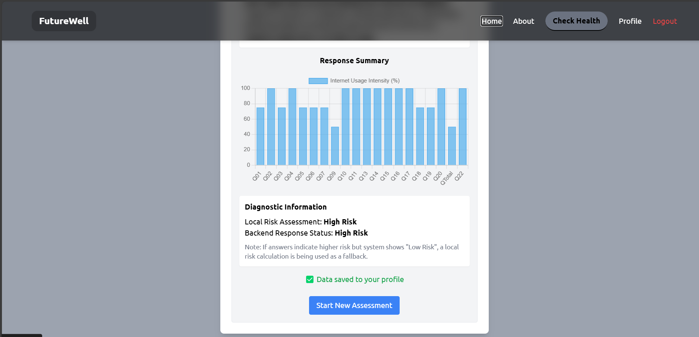

# 🌐 Internet Addiction Assessment Tool  

## 📝 Problem Statement  
Excessive internet use in children can negatively impact their well-being, making early detection crucial.  

## 🎯 Project Description  
With the growing use of digital devices, some children develop unhealthy internet habits. This project aims to identify early signs of problematic internet use in children by analyzing their behavior and activity data. By detecting risks early, parents and experts can provide timely support and promote healthier digital habits.  

---

## 📌 About the Project  
This project is a web-based application that helps users assess their **internet addiction levels** using a **machine learning model**. It provides **personalized suggestions** based on user responses using **Gemini 2.0 Flash**.  

## 🚀 Features  
✅ **Firebase Authentication** (Google & Email/Password sign-in)  
🧠 **Machine Learning Model** for analyzing user behavior  
📊 **Personalized Insights & Suggestions** using Gemini 2.0 Flash  
📁 **User Data Storage** in Firestore for logged-in users  
📉 **Graphical Representation** of results on user profiles  
⚡ **Built with Flask (Backend) & React (Frontend)**  

---

## 🛠️ Installation  
```sh
git clone https://github.com/adithyakrishnapn/futurewell
```
### 🔹 Backend (Flask)  
> **Recommended Python Version:** `3.11.0`  
```sh
cd server
pip install -r requirements.txt
python backendServer.py
```

### 🔹 Frontend (React)  
```sh
cd frontend
npm install
npm run dev
```

---

## 🔥 Firebase Setup  
1️⃣ Create a Firebase project at [Firebase Console](https://console.firebase.google.com/).  
2️⃣ Enable **Authentication** (Google & Email/Password).  
3️⃣ Set up **Firestore Database** to store user data.  
4️⃣ Add your **Firebase config** to `firebase.js` in the React app.  

---

## 🎯 Usage  
1️⃣ **Sign up or log in** using email/password or Google.  
2️⃣ **Take the internet addiction assessment**.  
3️⃣ **View personalized insights and suggestions**.  
4️⃣ **Track progress through graphical data on your profile**.  

---

## 🏗️ Tech Stack  
- **Frontend:** React, Tailwind CSS  
- **Backend:** Flask, Python  
- **Database:** Firebase Firestore  
- **ML Model:** Gemini 2.0 Flash  

---

## 🧠 Data Model  
The machine learning model is stored inside:  
📂 **`server/health_model_20_features.pkl`**  

---

## 📸 Screenshots  

<p align="center">
  
  
  
  
  
</p>

---

## DEMO VIDEO LINK
- [Explanation about problem statement](https://youtu.be/Af06PeFbDsg?feature=shared)
- [Demo Video](https://youtu.be/X8gGkSgit94?feature=shared)
---

## 🏆 Contributors  
- 👤 **Adithya Krishna P N**  
- 👤 **Dharshan R**  
- 👤 **Jeeva MP**  
- 👤 **Lakshmanan R**  

---


